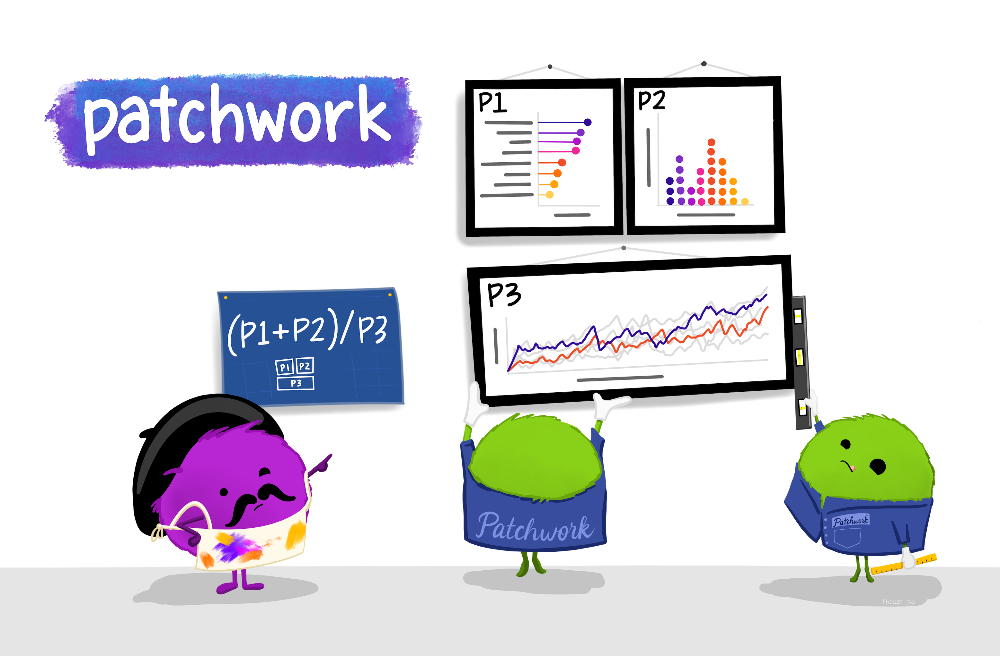

```{r setup, include=FALSE}
# For htmltools package, you may set options(htmltools.dir.version = FALSE) to suppress the version number in the subdirectory name.
options(htmltools.dir.version = FALSE)
knitr::opts_chunk$set(echo = TRUE)
knitr::opts_chunk$set(warning = FALSE)
knitr::opts_chunk$set(message = FALSE)

library(knitr)
library(dplyr)
library(ggplot2)
```

background-size: 80%
background-image: url(img/ggplot2_masterpiece.png)
background-position: 70% 70%
class: center, top

.footnote[
* Illustrations by Allison Horst, RStudio Artist in Residence, <https://github.com/allisonhorst/stats-illustrations>
]


---

class: center, middle, inverse

# Be an Artist! 
# Create Awesome Figures with `ggplot2`

---

.left-code[

# Make a Scatterplot

Let's look at the Palmer Penguins dataset again. Make a scatterplot of

```{r plot-label, eval=FALSE}
library(palmerpenguins)

# Make a scatterplot
ggplot(penguins) + 
  aes(x=bill_length_mm, 
      y=bill_depth_mm, 
      color = species) + 
  geom_point() +
  xlab("Bill Length (mm)") +
  ylab("Bill Depth (mm)") +
  ggtitle("Penguins Bill Dimensions")
  
```
]

.right-plot[
```{r plot-label-out, ref.label="plot-label", echo=FALSE, out.width="100%"}
```
]

---

.left-code[

# Scatterplot - make plot area

```{r plot-label1, eval=FALSE}
# Step 1 specify dataset 
# penguins for ggplot()
ggplot(penguins) #<<
```

The basic plot space is created.

]

.right-plot[
```{r plot-label1-out, ref.label="plot-label1", echo=FALSE, out.width="100%"}
```
]

---

.left-code[

# Scatterplot - add aethetics

```{r plot-label2, eval=FALSE}
# Next add aes (aesthetics)
ggplot(penguins) + 
  aes(x=bill_length_mm, #<<
      y=bill_depth_mm)  #<<
```

Add "aesthetics" using aes - provide the variables for X and Y axes. Notice the `aes()` is added using the `+` operator.

]

.right-plot[
```{r plot-label2-out, ref.label="plot-label2", echo=FALSE, out.width="100%"}
```
]

---

.left-code[

# Add a `geom_xxx` - Geometric Object

```{r plot-label3, eval=FALSE}
# Add points to graph
ggplot(penguins) + 
  aes(x=bill_length_mm, 
      y=bill_depth_mm) + 
  geom_point() #<<
  
```

Add `geom_point()` to add the **points** to the graph.

]

.right-plot[
```{r plot-label3-out, ref.label="plot-label3", echo=FALSE, out.width="100%"}
```
]

---

.left-code[

# Add Color - use `aes()`

```{r plot-label4, eval=FALSE}
# Add color aesthetic
ggplot(penguins) + 
  aes(x=bill_length_mm, 
      y=bill_depth_mm,
      color = species) + #<<
  geom_point() 
  
```

Add `color` option to the aesthetics inside the `aes()`.

]

.right-plot[
```{r plot-label4-out, ref.label="plot-label4", echo=FALSE, out.width="100%"}
```
]

---

.left-code[

# Add Labels - to the axes and add a title

```{r plot-label5, eval=FALSE}
# Add axis labels and a title
ggplot(penguins) + 
  aes(x=bill_length_mm, 
      y=bill_depth_mm,
      color = species) + 
  geom_point() +
  xlab("Bill Length(mm)") +   #<<
  ylab("Bill Depth (mm)") +    #<<
  ggtitle("Penguins Bill Dimensions")  #<<
  
```

Add axis labels with `xlab()` and `ylab()` and add a title with `ggtitle()`.

]

.right-plot[
```{r plot-label5-out, ref.label="plot-label5", echo=FALSE, out.width="100%"}
```
]

---

class: center, middle, inverse

# Great Resources for R Graphics
<hr>

## R Graphics Cookbook

### [https://r-graphics.org/](https://r-graphics.org/)

### [http://www.cookbook-r.com/Graphs/](http://www.cookbook-r.com/Graphs/)

&

## R-Gallery

### [https://www.r-graph-gallery.com/](https://www.r-graph-gallery.com/)

---

.footnote[See code examples at [http://www.cookbook-r.com/Graphs/Plotting_distributions_(ggplot2)/](http://www.cookbook-r.com/Graphs/Plotting_distributions_(ggplot2)/)]

.left-code[

# Make a histogram with overlaid density curve

```{r histplot, eval=FALSE}
# Look at flipper_length_mm
# for Palmer Penguins
# Histogram with density curve
# Use y=..density..
# Overlay with transparent density plot
ggplot(penguins, 
       aes(x=flipper_length_mm)) + 
  geom_histogram(aes(y=..density..),      
                 binwidth=2,
                 colour="black", 
                 fill="white") +
  geom_density(alpha=.2, 
               fill="#FF6666") 
```

]

.right-plot[

```{r histplot-out, ref.label="histplot", echo=FALSE, out.width="90%"}
```

]

---

# Break out by Facet/Panels

.left-code[

```{r histplot2, eval=FALSE}
# Look at flipper_length_mm
# for Palmer Penguins
# Histogram with density curve
# Use y=..density..
# Overlay with transparent density plot
ggplot(penguins, 
       aes(x=flipper_length_mm)) + 
  geom_histogram(aes(y=..density..),      
                 binwidth=2,
                 colour="black", 
                 fill="white") +
  geom_density(alpha=.2, 
               fill="#FF6666") +
  facet_wrap(vars(species)) #<<
```

Add `facet_wrap()` to make histogram plots for each penguin species in a different facet or panel.

]

.right-plot[

```{r histplot2-out, ref.label="histplot2", echo=FALSE, fig.dim=c(5, 3), out.width="100%"}
```

]

---

class: center, middle, inverse

# Pulling it together - make a canvas

# Patchwork!

```{r out.width = '20%', echo=FALSE}
knitr::include_graphics("img/patchworklogo.png")
```
.footnote[
Learn more at [https://patchwork.data-imaginist.com/](https://patchwork.data-imaginist.com/) and fun R-Bloggers post [https://www.r-bloggers.com/2020/03/patchwork-r-package-goes-nerd-viral/](https://www.r-bloggers.com/2020/03/patchwork-r-package-goes-nerd-viral/)
]
---

```{r out.width = '80%', echo=FALSE}

```

.footnote[
* Illustrations by Allison Horst, RStudio Artist in Residence, <https://github.com/allisonhorst/stats-illustrations>
]
---

## Saving plots as objects

.left-code[

```{r plot-p1obj, eval=FALSE}
# save a plot as an object
p1 <- ggplot(penguins, 
         aes(x=bill_length_mm, 
             y=bill_depth_mm, 
             color = species)) +
  geom_point()  
  
# plot the object
p1 #<<
```

]

.right-plot[

```{r plot-p1obj-out, ref.label="plot-p1obj", echo=FALSE, fig.dim=c(8, 6)}
```

]

---

## Side by Side - use syntax `p1 | p2`

.left-code[

```{r plot-side, eval=FALSE}
library(ggplot2)
library(patchwork)

# create another plot object
p2 <- ggplot(penguins, 
             aes(x=species, 
                 y=bill_length_mm)) + 
  geom_boxplot() + 
  xlab("Species") +   
  ylab("Bill Depth (mm)")

# arrange the plot objects
(p1 | p2) #<<
```

]

.right-plot[

```{r plot-side-out, ref.label="plot-side", echo=FALSE, fig.dim=c(8, 6)}
```

]

---

## Stack 2 Plots - use syntax `p2 / p3`

.left-code[

```{r plot-stack, eval=FALSE}
# make another plot
p3 <- 
  ggplot(penguins, 
         aes(x=flipper_length_mm)) + 
  geom_histogram(aes(y=..density..),      
    binwidth=2, colour="black", 
    fill="white") +
  geom_density(alpha=.2, fill="#FF6666") +
  facet_wrap(vars(species))

# arrange plots top / bottom
p2 / p3 #<<
```

]

.right-plot[

```{r plot-stack-out, ref.label="plot-stack", echo=FALSE, fig.dim=c(8, 6)}
```

]

---

## Combine - syntax `(p1 | p2)/p3`

.left-code[

```{r plot-patch, eval=FALSE}
# combine syntax
# arrange plots as you like
(p1 | p2) / p3 #<<
```

]

.right-plot[

```{r plot-patch-out, ref.label="plot-patch", echo=FALSE, fig.dim=c(8, 6)}
```

]

---

class: center, middle, inverse

# Thank you!
<hr>

# Melinda Higgins

### Materials for this presentation
[https://melindahiggins2000.github.io/AtlantaRUsers_24June2021/](https://melindahiggins2000.github.io/AtlantaRUsers_24June2021/)

### More about me
[https://melindahiggins.com/](https://melindahiggins.com/)


